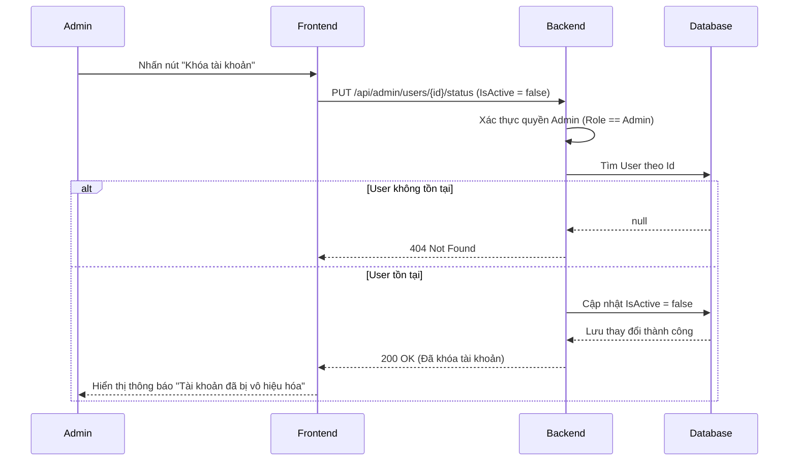

# Software Requirement Specification (SRS)

## Chức năng: Quản lý tài khoản người dùng

**Mã chức năng:** USER-01  
**Trạng thái:** Draft / Review  
**Người soạn thảo:** VŨ TRƯỜNG GIANG  
**Vai trò:** Developer / Analyst

---

### 1. Mô tả tổng quan (Description)

Chức năng này tập trung vào việc quản lý quyền truy cập thông qua cơ chế khóa tài khoản. Nó cho phép Quản trị viên (Admin) vô hiệu hóa quyền truy cập của một người dùng bất kỳ (Customer hoặc Owner) vào hệ thống. Khi thực hiện thao tác này, trạng thái hoạt động của tài khoản sẽ được chuyển về `IsActive = false`. Người dùng có tài khoản bị khóa sẽ không thể đăng nhập hoặc thực hiện bất kỳ thao tác nào yêu cầu xác thực.

---

### 2. Luồng nghiệp vụ (User Workflow)

| Bước | Hành động của Admin                                  | Phản hồi hệ thống                                               |
| :--- | :--------------------------------------------------- | :-------------------------------------------------------------- |
| 1    | Truy cập trang "Quản lý người dùng"                  | Hiển thị danh sách người dùng kèm trạng thái hiện tại           |
| 2    | Tìm người dùng cần khóa và nhấn nút "Khóa tài khoản" | Hiển thị hộp thoại xác nhận yêu cầu khóa                        |
| 3    | Xác nhận hành động khóa                              | Gửi request PUT đến API hệ thống để cập nhật IsActive           |
| 4    | Backend xử lý yêu cầu                                | Tìm người dùng trong DB và cập nhật `IsActive = false`          |
| 5    | Thành công                                           | Trả về thông báo thành công và cập nhật nhãn trạng thái trên UI |

---

### 3. Sơ đồ trình tự (Sequence Diagram)



---

### 4. Yêu cầu dữ liệu (Data Requirements)

#### 4.1. Dữ liệu đầu vào

- `userId`: Mã định danh (Guid) của người dùng cần khóa.
- `Admin Token`: JWT Token chứa Claim Role là `Admin`.

#### 4.2. Logic xử lý Backend

- **Kiểm tra quyền hạn:** Chỉ tài khoản có `Role == Admin` mới được phép gọi API này.
- **Cập nhật dữ liệu:**
  - Tìm thực thể `AppUser` trong database.
  - Gán giá trị `IsActive = false`.
  - Lưu thay đổi (`SaveChangesAsync`).
- **Ràng buộc:** Admin không được phép tự khóa chính tài khoản của mình (để tránh mất quyền quản trị hệ thống).

#### 4.3. Dữ liệu đầu ra (Response)

- **Thành công:** Trả về trạng thái 200 kèm thông báo xác nhận.
- **Thất bại:** Trả về lỗi 403 (Forbidden) nếu không phải Admin hoặc 404 nếu sai ID người dùng.

---

### 5. Ràng buộc kỹ thuật & Bảo mật

- **Middleware:** API phải được bảo vệ bởi thuộc tính `[Authorize(Roles = "Admin")]`.
- **Tính nhất quán:** Ngay sau khi `IsActive` chuyển sang `false`, nếu hệ thống có sử dụng cơ chế kiểm tra Token định kỳ hoặc Refresh Token, các phiên làm việc hiện tại của người dùng bị khóa phải bị hủy bỏ (Logout ngay lập tức).
- **Kiểm tra đăng nhập:** Tài liệu `SRS_LOGIN.md` phải bổ sung bước kiểm tra trường `IsActive` trước khi cấp phát JWT Token.

---

### 6. Trường hợp ngoại lệ (Edge Cases)

| Tình huống                              | Cách xử lý                                                                                    |
| :-------------------------------------- | :-------------------------------------------------------------------------------------------- |
| Admin cố tình khóa tài khoản chính mình | Backend trả về lỗi 400: "Bạn không thể tự khóa tài khoản của chính mình."                     |
| Tài khoản đã ở trạng thái khóa từ trước | Backend vẫn thực hiện gán và trả về thành công (Idempotent) hoặc thông báo tài khoản đã khóa. |
| Khóa tài khoản của Admin khác           | Tùy vào chính sách, hệ thống có thể cho phép SuperAdmin khóa Admin thường hoặc cấm hoàn toàn. |

---

### 7. Giao diện tích hợp (UI/UX)

- **Nhãn trạng thái:**
  - Tài khoản đang hoạt động: Hiển thị nhãn **Active** (Màu xanh).
  - Tài khoản bị khóa: Hiển thị nhãn **Locked/Inactive** (Màu đỏ).
- **Thao tác:** Nút "Khóa" nên được thay thế bằng nút "Mở khóa" nếu tài khoản đã ở trạng thái `IsActive = false`.
- **Xác nhận:** Luôn yêu cầu Admin xác nhận qua Modal trước khi thực hiện thay đổi trạng thái người dùng.

---

### 8. Điều kiện tiền đề & Hậu điều kiện

- **Tiền đề:**
  - Admin đã đăng nhập và có quyền quản trị.
  - Tài khoản người dùng mục tiêu tồn tại trong hệ thống.
- **Hậu điều kiện:**
  - Trường `IsActive` của người dùng trong bảng `AppUsers` bằng `false`.
  - Người dùng không thể sử dụng chức năng Đăng nhập.

```


```
