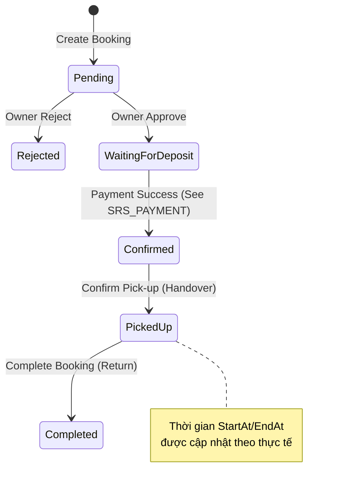

# Software Requirement Specification (SRS)

## Chức năng: Quản lý Đặt xe và Quy trình Thuê xe (Booking & Rental Workflow)

**Mã chức năng:** BOOK-01  
**Trạng thái:** Draft  
**Người soạn thảo:** VŨ TRƯỜNG GIANG  
**Vai trò:** Developer / Analyst

---

### 1. Mô tả tổng quan (Description)

Chức năng này quản lý toàn bộ vòng đời của một giao dịch thuê xe giữa Khách thuê (Customer) và Chủ xe (Owner). Quy trình bao gồm việc kiểm tra tính sẵn sàng của xe, tính toán chi phí, xác nhận các điều khoản hợp đồng điện tử, và theo dõi trạng thái từ khi đặt xe đến khi hoàn trả tài sản.

---

### 2. Luồng nghiệp vụ (Workflow)

#### 2.1. Khởi tạo đơn thuê (Customer)

1. Khách hàng chọn xe, thời gian thuê và phương thức nhận xe.
2. Hệ thống kiểm tra trùng lịch (Overlap check) và tính toán tổng tiền (bao gồm bảo hiểm và giảm giá).
3. Khách hàng phải đồng ý với các điều khoản hợp đồng (`CustomerAgreedTerms`).
4. Hệ thống tạo bản ghi `Booking` và bản ghi `RentalAgreement` (Hợp đồng) kèm file PDF snapshot.

#### 2.2. Phê duyệt đơn thuê (Owner)

1. Chủ xe xem danh sách yêu cầu thuê xe (`Pending`).
2. Chủ xe nhấn **Approve** (Duyệt) hoặc **Reject** (Từ chối).
3. Khi Duyệt: Đơn chuyển sang trạng thái `WaitingForDeposit` (Chờ thanh toán).
4. Hệ thống cập nhật lại nội dung hợp đồng với thời gian xác nhận của chủ xe.

#### 2.3. Bàn giao xe - Bắt đầu chuyến đi (Owner)

1. Sau khi khách đã thanh toán (Trạng thái `Confirmed`), chủ xe thực hiện bàn giao xe thực tế.
2. Chủ xe nhấn **Confirm Pick-up**.
3. Hệ thống cập nhật thời gian bắt đầu thực tế (`StartAt`) và tính toán lại thời gian kết thúc dự kiến dựa trên thời lượng thuê ban đầu.
4. Trạng thái chuyển sang `PickedUp` (Đang thuê).

#### 2.4. Trả xe - Kết thúc chuyến đi (Owner)

1. Khi khách trả xe, chủ xe kiểm tra tình trạng xe và nhấn **Complete**.
2. Hệ thống ghi lại thời gian trả thực tế, cập nhật trạng thái `Completed`.
3. Hợp đồng PDF được cập nhật lần cuối với đầy đủ các mốc thời gian thực tế.

---

### 3. Sơ đồ trạng thái (State Diagram)

---

### 4. Chi tiết logic xử lý (Business Logic)

#### 4.1. Kiểm tra ràng buộc khi đặt xe

- **Trùng lịch (Overlap):** Hệ thống từ chối nếu xe đã có đơn khác ở trạng thái `WaitingForDeposit`, `Confirmed`, hoặc `PickedUp` trong cùng khoảng thời gian.
- **Chính chủ:** Khách hàng không thể tự thuê xe của chính mình.
- **Trạng thái xe:** Chỉ cho phép đặt những xe đang ở trạng thái `IsAvailable = true`.
- **Thời gian:** Thời gian bắt đầu không được ở quá khứ.

#### 4.2. Công thức tính tiền

`Tổng tiền = ((Giá thuê/Ngày + Phí bảo hiểm/Ngày) * Số ngày thuê) - Giảm giá`
_Lưu ý: Số ngày thuê được làm tròn lên (Ceiling)._

#### 4.3. Hợp đồng điện tử (Rental Agreement)

- Mỗi đơn thuê đi kèm một `ContractSnapshot` lưu trữ nội dung văn bản tại thời điểm ký.
- Mỗi khi trạng thái thay đổi (Duyệt, Thanh toán, Nhận xe, Trả xe), hệ thống tự động Generate lại file PDF hợp đồng để đảm bảo tính pháp lý.

---

### 5. Yêu cầu dữ liệu (Data Requirements)

#### 5.1. Dữ liệu đầu vào (Booking DTO)

- `CarId`, `StartAt`, `EndAt`.
- `PickupType` (Tại chỗ / Giao xe tận nơi).
- `PickupAddress`.
- `RentalPapers` (Giấy tờ thế chấp).
- `Collateral` (Tài sản thế chấp/Tiền mặt).

#### 5.2. Các trường thông tin Snapshot (Bảo toàn dữ liệu lịch sử)

Để tránh việc chủ xe thay đổi giá hoặc thông tin xe làm ảnh hưởng đến đơn hàng cũ, hệ thống lưu snapshot:

- `CarNameSnapshot`, `CarLicensePlateSnapshot`.
- `CustomerNameSnapshot`, `OwnerNameSnapshot`.
- `PricePerDay`, `InsurancePerDay`.

---

### 6. Ràng buộc kỹ thuật & Bảo mật

- **Phân quyền:**
  - Khách thuê chỉ thấy đơn của mình (`GetMyBookings`).
  - Chủ xe chỉ thấy đơn thuê xe của họ (`GetOwnerBookings`).
  - Chỉ chủ xe mới có quyền nhấn `Approve`, `Reject`, `Pick-up`, `Complete`.
- **Toàn vẹn dữ liệu:** Sử dụng `Database Transaction` trong quá trình phê duyệt đơn để đảm bảo cập nhật trạng thái Booking và tạo Hợp đồng luôn đi kèm với nhau.
- **Tối ưu hóa:** Sử dụng `.AsNoTracking()` cho các API lấy danh sách để tăng tốc độ phản hồi.

---

### 7. Các trường hợp ngoại lệ (Edge Cases)

| Tình huống                                              | Xử lý                                                                                                                       |
| :------------------------------------------------------ | :-------------------------------------------------------------------------------------------------------------------------- |
| Xe vừa được đặt bởi người khác trong lúc đang điền form | Backend kiểm tra lại overlap một lần nữa trước khi Save và trả về lỗi 400.                                                  |
| Chủ xe duyệt đơn nhưng khách không thanh toán           | Hệ thống có cơ chế `AutoCancelTimeoutMinutes` (mặc định 15-30p) để hủy đơn (Xử lý trong phần Webhook/Job).                  |
| Khách lấy xe trễ hơn dự kiến                            | Khi nhấn `Pick-up`, hệ thống tự động đẩy lùi thời gian `EndAt` tương ứng để khách không bị thiệt thòi về thời gian sử dụng. |
| Hợp đồng PDF bị lỗi khi generate                        | Hệ thống vẫn cho phép chuyển trạng thái nhưng ghi log lỗi để Admin xử lý thủ công.                                          |

---

### 8. Giao diện tích hợp (UI/UX)

- **Khách hàng:** Trang "Chuyến đi của tôi" hiển thị danh sách Card, mỗi trạng thái có màu sắc riêng (Vàng: Chờ duyệt, Xanh dương: Đã thanh toán, Xanh lá: Hoàn thành).
- **Chủ xe:** Dashboard quản lý yêu cầu, có nút bấm thao tác nhanh cho từng bước của quy trình.
- **Xem PDF:** Tích hợp trình xem PDF trực tiếp hoặc nút tải về hợp đồng ở mọi giai đoạn.
