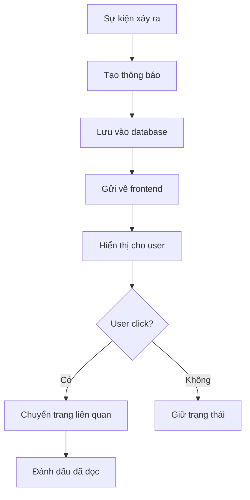
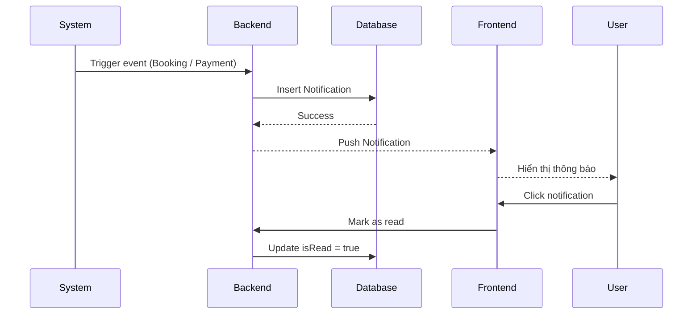

# Software Requirement Specification (SRS)

## Chức năng: Thông báo (Notification System)

**Mã chức năng:** NOTI-01  
**Trạng thái:** Draft / Review  
**Người soạn thảo:** Nguyễn Văn Công  
**Vai trò:** Developer / Analyst  

---

## 1. 📌 Mô tả tổng quan (Description)

Chức năng thông báo giúp hệ thống gửi thông tin đến người dùng khi có sự kiện quan trọng xảy ra.

Các loại thông báo bao gồm:

- Thông báo về đơn thuê (Booking)
- Thông báo thanh toán (Payment)
- Thông báo hệ thống (System)

Người dùng có thể:

- Xem danh sách thông báo
- Đánh dấu đã đọc
- Nhận thông báo theo thời gian thực (optional)

## 2. 🔄 Luồng nghiệp vụ (User Workflow)

| Bước | Hành động người dùng | Phản hồi hệ thống |
| :--- | :--- | :--- |
| 1 | Người dùng đăng nhập | Hệ thống load thông báo |
| 2 | Có sự kiện xảy ra (booking, payment) | Hệ thống tạo thông báo |
| 3 | Người dùng mở thông báo | Hiển thị danh sách |
| 4 | Nhấn vào thông báo | Chuyển đến trang liên quan |
| 5 | Đánh dấu đã đọc | Cập nhật trạng thái |

## 🔄 Notification Flow (Mermaid Diagram)




## 🔗 Sequence Diagram




## 3. 📊 Yêu cầu dữ liệu (Data Requirements)

### Input

- userId
- title
- message
- type (Booking / Payment / System)
- referenceId (id của booking hoặc payment)

---

### Output

- Danh sách thông báo
- Trạng thái đã đọc / chưa đọc

## 4. 🔌 API Specification

### Lấy danh sách thông báo

GET /api/notifications

---

### Đánh dấu đã đọc

PUT /api/notifications/{id}/read

---

### Response mẫu

```json
[
  {
    "id": "string",
    "title": "Thanh toán thành công",
    "message": "Bạn đã thanh toán thành công đơn thuê",
    "type": "Payment",
    "isRead": false,
    "createdAt": "2026-04-12"
  }
]

```
---

## 5. ⚠️ Edge Cases

- Người dùng chưa đăng nhập → không lấy được thông báo
- Không có thông báo → trả về danh sách rỗng
- Click thông báo đã đọc → không thay đổi trạng thái
- Lỗi server → hiển thị lỗi

## 6. 📏 Business Rules

- Mỗi thông báo thuộc về 1 user
- Thông báo phải lưu trong database
- Không xóa thông báo (chỉ đánh dấu đã đọc)
- Thông báo liên quan đến booking phải có referenceId

## 7. 🎨 UI

- Icon chuông (notification)
- Badge số lượng chưa đọc
- Dropdown danh sách thông báo
- Click → chuyển trang

## 8. ✅ Acceptance Criteria

- Hiển thị đúng thông báo theo user
- Có thể đánh dấu đã đọc
- Hiển thị số lượng chưa đọc
- Điều hướng đúng khi click

## 9. 📌 Pre-condition

- User đã đăng nhập
- Có dữ liệu notification

---

## 10. 📌 Post-condition

- User nhận được thông báo
- Trạng thái được cập nhật