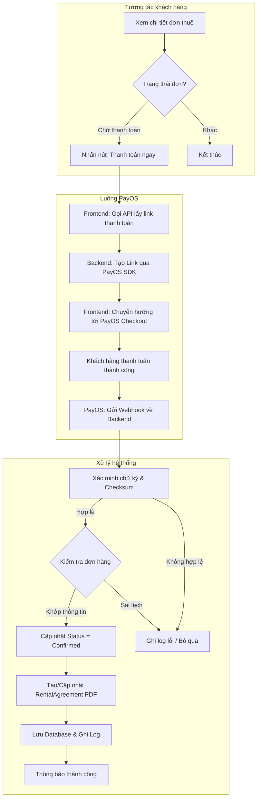
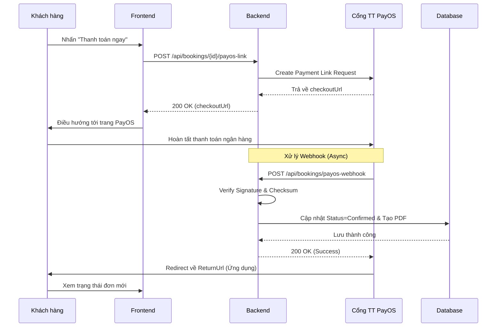

# Software Requirement Specification (SRS)

## Chức năng: Thanh toán đơn thuê xe qua PayOS

**Mã chức năng:** BOOK-03  
**Trạng thái:** Draft / Review  
**Người soạn thảo:** Vũ Trường Giang  
**Vai trò:** Developer  

---

### 1. Mô tả tổng quan (Description)

Chức năng này cho phép khách hàng thanh toán trực tuyến cho đơn thuê xe đã được chủ xe phê duyệt thông qua cổng thanh toán PayOS. Hệ thống tự động xác nhận giao dịch và cập nhật trạng thái đơn hàng khi nhận được Webhook từ PayOS.

Sau khi thanh toán thành công:
- Trạng thái đơn thuê cập nhật thành "Đã xác nhận" (Confirmed).
- Hợp đồng thuê xe (PDF) được tạo/cập nhật tự động.

---

### 2. Luồng nghiệp vụ (User Workflow)

| Bước | Hành động người dùng                                          | Phản hồi hệ thống                                                                                      |
| :--- | :------------------------------------------------------------ | :----------------------------------------------------------------------------------------------------- |
| 1    | Truy cập chi tiết đơn thuê đang ở trạng thái "Chờ thanh toán" | Hiển thị nút "Thanh toán ngay"                                                                         |
| 2    | Nhấn nút "Thanh toán ngay"                                    | Frontend gọi API `POST /api/bookings/{id}/payos-link`                                                  |
| 3    | Hệ thống khởi tạo giao dịch                                   | Backend gọi PayOS API, nhận `checkoutUrl`                                                              |
| 4    | Chuyển hướng thanh toán                                       | Frontend điều hướng người dùng đến trang checkout của PayOS                                            |
| 5    | Thực hiện thanh toán trên PayOS                               | PayOS xử lý giao dịch ngân hàng                                                                        |
| 6    | PayOS thông báo kết quả                                       | PayOS gửi Webhook `POST /api/bookings/payos-webhook` về Backend                                        |
| 7    | Backend xử lý hậu thanh toán                                  | Xác minh chữ ký, cập nhật trạng thái đơn thành "Đã xác nhận", tạo hợp đồng PDF                         |
| 8    | Hoàn tất                                                      | Khách hàng được chuyển hướng về app và nhận thông báo thành công                                       |

---

## 🔄 Payment Flow (Mermaid Diagram)

---

### 3. Yêu cầu dữ liệu (Data Requirements)

#### 3.1. Dữ liệu đầu vào (Input)
- **API tạo link**: `id` (Guid) của đơn thuê.
- **Webhook**: Payload từ PayOS (gồm `data`, `signature`, `checksum`).

#### 3.2. Logic xử lý Backend
- **Tạo Link**: Kiểm tra đơn thuê phải có trạng thái `WaitingForDeposit`. Tạo mã đơn hàng (`orderCode`) duy nhất dựa trên Timestamp.
- **Xử lý Webhook**: 
    - Phải dùng `PayOS SDK` để `Verify`.
    - Kiểm tra số tiền nhận được (`data.amount`) có khớp với `TotalAmount` của đơn thuê hay không.
    - Kiểm tra thời gian thanh toán không được vượt quá thời hạn cho phép.

#### 3.3. Dữ liệu lưu trữ (Database)
- **Bookings**: Cập nhật `Status` từ `WaitingForDeposit` sang `Confirmed`.
- **Note**: Ghi đè hoặc bổ sung thông tin mã giao dịch PayOS.
- **RentalAgreements**: Lưu trữ link PDF được sinh ra sau khi thanh toán.

---

### 4. Ràng buộc kỹ thuật & Bảo mật
- **Xác thực**: Chỉ khách hàng sở hữu đơn thuê mới được quyền tạo link thanh toán.
- **An toàn Webhook**: Endpoint Webhook phải được mở Public nhưng bắt buộc phải kiểm tra tính toàn vẹn dữ liệu qua `ChecksumKey`.
- **Idempotency**: Nếu PayOS gửi Webhook nhiều lần cho cùng một giao dịch, hệ thống chỉ xử lý cập nhật đơn hàng một lần duy nhất.

---

### 5. Trường hợp ngoại lệ & Xử lý lỗi
- **Thanh toán thất bại/Hủy**: Nếu khách hàng hủy trên trang PayOS, trả khách về trang đơn thuê với thông báo "Thanh toán đã bị hủy".
- **Hết hạn (Timeout)**: Nếu đơn hàng đã bị hệ thống tự động hủy (Expired) trước khi khách thanh toán thành công, Webhook sẽ ghi log và không cập nhật trạng thái.
- **Sai số tiền**: Nếu số tiền thanh toán không khớp, không cập nhật trạng thái đơn và bắn thông báo cảnh báo cho Admin.

---

### 6. Giao diện (UI/UX)
- Nút "Thanh toán ngay" nổi bật trong trang chi tiết đơn thuê.
- Loading Overlay hiển thị trong lúc chờ chuyển hướng sang PayOS.
- Thông báo Toast/Modal báo thành công ngay sau khi khách hàng quay lại từ cổng thanh toán.
