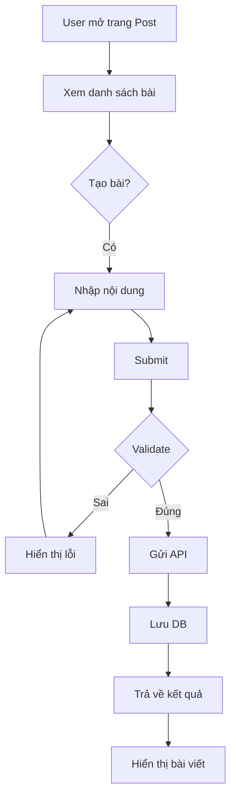
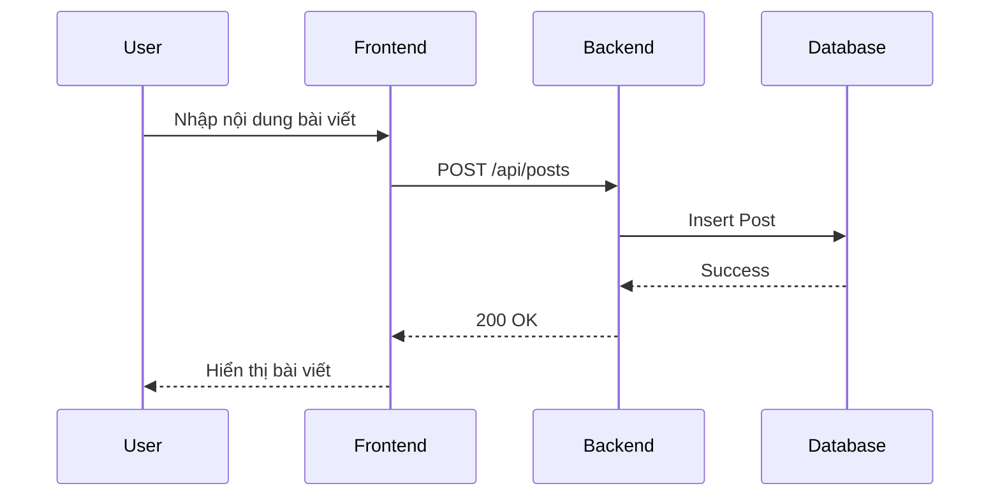

# Software Requirement Specification (SRS)

## Chức năng: Bài viết / Tin tức (Post System)

**Mã chức năng:** POST-01  
**Trạng thái:** Draft / Review  
**Người soạn thảo:** Nguyễn Văn Công  
**Vai trò:** Developer / Analyst  

---

## 1. 📌 Mô tả tổng quan (Description)

Chức năng bài viết cho phép người dùng tạo và tương tác với nội dung trong hệ thống.

Người dùng có thể:

- Đăng bài viết
- Xem danh sách bài viết
- Xem chi tiết bài viết
- Like bài viết
- Comment bài viết

Admin có thể:

- Quản lý bài viết
- Ẩn / xóa bài viết không phù hợp

👉 Mục đích:
- Tăng tương tác người dùng
- Xây dựng cộng đồng trong hệ thống

## 2. 🔄 Luồng nghiệp vụ (User Workflow)

| Bước | Hành động người dùng | Phản hồi hệ thống |
| :--- | :--- | :--- |
| 1 | Truy cập trang bài viết | Hiển thị danh sách |
| 2 | Nhấn “Đăng bài” | Hiển thị form |
| 3 | Nhập nội dung | Validate dữ liệu |
| 4 | Nhấn đăng | Gửi API |
| 5 | Backend xử lý | Lưu DB |
| 6 | Thành công | Hiển thị bài viết |

## 🔄 Post Flow (Mermaid Diagram)

---

## 🔗 Sequence Diagram

---

## 3. 📊 Yêu cầu dữ liệu (Data Requirements)

### Input

- userId
- title
- content
- image (optional)

---

### Output

- Danh sách bài viết
- Chi tiết bài viết

## 4. 🔌 API Specification

### Tạo bài viết

POST /api/posts

Body:

{
  "title": "string",
  "content": "string",
  "image": "string"
}

---

### Lấy danh sách bài

GET /api/posts

---

### Like bài

POST /api/posts/{id}/like

---

### Comment bài

POST /api/posts/{id}/comment

---

### Response Codes

- 200 OK  
- 201 Created  
- 400 Bad Request  
- 401 Unauthorized  
- 500 Internal Server Error  

## 5. ⚠️ Edge Cases

- Chưa đăng nhập → không được đăng bài
- Nội dung rỗng → báo lỗi
- Like trùng → không tăng thêm
- Comment rỗng → không lưu

## 6. 📏 Business Rules

- Mỗi user có thể đăng nhiều bài
- Một user chỉ like 1 bài 1 lần
- Comment phải thuộc về 1 bài viết
- Admin có quyền xóa bài viết

## 7. 🎨 UI

- Danh sách bài viết
- Form đăng bài
- Nút like
- Khung comment

## 8. ✅ Acceptance Criteria

- Người dùng đăng bài thành công
- Hiển thị danh sách bài viết
- Like và comment hoạt động
- Admin có thể quản lý bài viết

## 9. 📌 Pre-condition

- User đã đăng nhập

---

## 10. 📌 Post-condition

- Bài viết được lưu
- Hiển thị cho người dùng khác